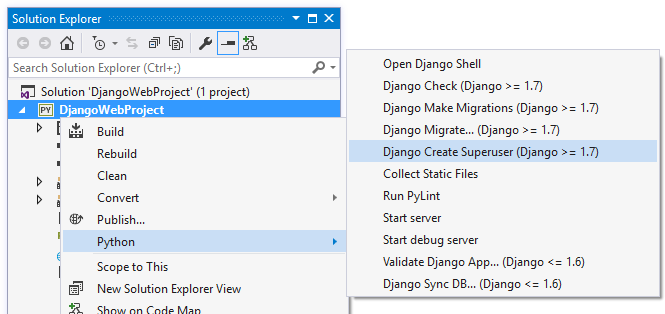

# One more thing...

Before running this project, you may want to **create a super user**.

# Synchronize the Database

This project has default settings for the database (it uses sqlite). If you need a super user, you&#39;ll need to create one before running the project.

1. Open Solution Explorer.
2. Right-click the project node and select Python-&gt;Django Create Superuser.

 

1. Enter account details when prompted. This creates a new account, and the details do not need to match any of your existing accounts.